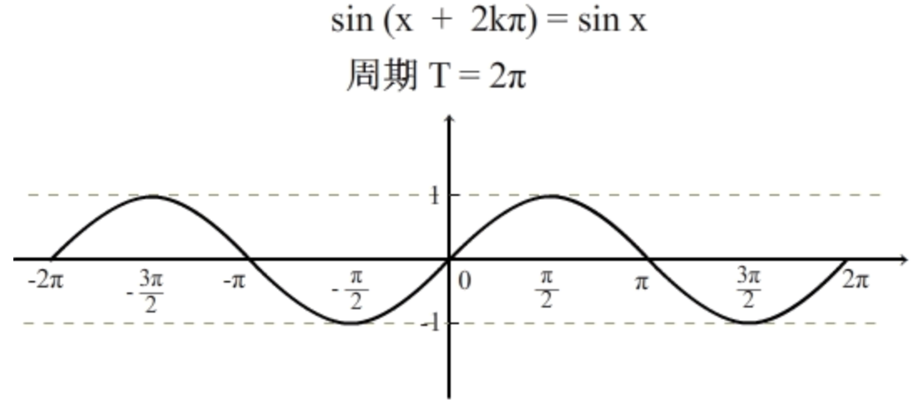
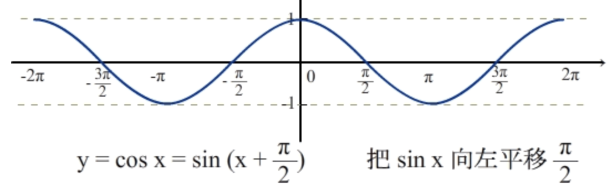

# 初等数学

## [有理数无理数](https://www.shuxuele.com/irrational-numbers.html)

## 三角函数

### 特殊角度的三角函数值表

### 正弦

sinΦ = 对边/斜边

#### 正弦定理

#### 正弦函数图像

### 余弦

cosΦ = 邻边/斜边

#### 余弦定理

三角形中任何一边的平方 = 其它两边的平方和减去这两边与它们的夹角的余弦的积的两倍。

$$
a^2 = b^2 + c^2 – 2bc  * cosA
$$

$$
b^2 = a^2 + c^2 –2ac  * cosB
$$

$$
c^2 = a^2 + b^2 – 2ab  * cosC
$$

#### 余弦函数图像

- cos x = sin (x + π/2)，即余弦函数的图像等于正弦函数向左平移 π/2 个单位长度。

###  正弦余弦函数图像动画

<iframe height=498 width=510 src="../assets/videos/sin_cos.mp4"></iframe>

### 正切

tanΦ = 对边/邻边 = sinΦ/cosΦ

### 余切

### 正割

### 余割

### 反正弦

### 反余弦

### 反正切

### 反余切

## [欧拉常数e](https://www.shuxuele.com/numbers/e-eulers-number.html)

## [指数和对数](https://www.shuxuele.com/algebra/exponents-logarithms.html)

$$
log_a(a^x) = x
$$

$$
a^{log_ax} = x
$$

$$
log_a{(m * n)} = log_am + log _an
$$

$$
log_a{(m / n)} = log_am - log_an
$$

$$
log_a{(1/n)} = -log_an
$$

$$
log_a{(m^r)} = r(log_am)
$$

$$
log_ax = \frac{log_bx}{log_ba}
$$

$$
log_ax = \frac{1}{log_xa}
$$

#### 自然指数和自然对数

- 底是 [欧拉常数e](#Aura) 的指数叫做自然指数,表示为 $e^x$

- 底是 [欧拉常数e](#Aura) 的对数叫做自然对数，表示为 $ln(x)$

  

## 指数函数

## 对数函数

## 幂函数

### 幂函数运算

#### 同底数幂函数运算

#### 同指数幂函数运算

## 

## 二项式定理

[最容易理解的二项式定理解释](https://www.shuxuele.com/algebra/binomial-theorem.html)

### 二项式展开与二项式系数

- 二项式系数等式

其中“!”代表 [阶乘](https://www.shuxuele.com/numbers/factorial.html)，例如 4！= 4\*3\*2\*1 = 24

## 

## 充分条件，必要条件

- 假设 A 是条件，B 是结论: 
- 由 A 可以推出B,由 B 可以推出A，则A是B的充要条件（充分且必要条件）。 
- 由 A 可以推出B,由 B 不可以推出A，则A是B的充分不必要条件。 
- 由 A 不可以推出 B, 由 B 可以推出A，则A是B的必要不充分条件。 
- 由 A 不可以推出 B, 由 B 不可以推出A，则A是B的不充分不必要条件。 
- 简单一点就是：由条件能推出结论，但由结论推不出这个条件，这个条件就是充分条件。 
- 如果能由结论推出条件，但由条件推不出结论,此条件为必要条件。 
- 如果既能由结论推出条件，又能有条件推出结论,此条件为充要条件。

