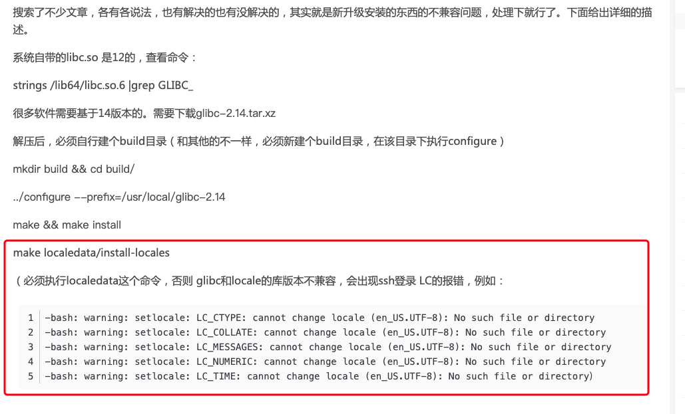

## 升级glibc 导致的locale 问题

这两天在给公司一台 `Centos7` 部署 NVIDIA GPU环境，发现需要升级 glibc,于是网上搜索了下教程，大概步骤如下：

```shell
wget http://ftp.wayne.edu/gnu/libc/glibc-2.32.tar.gz #这里我使用的是最新的 glibc 2.32 版本

tar -zxvf glibc-2.32.tar.gz

cd glibc-2.32

mkdir build

../configure  --prefix=/usr --disable-profile --enable-add-ons --with-headers=/usr/include --with-binutils=/usr/bin

make -j8

sudo make instal

# 检查是否正确安装且链接到了指定版本的libc库
ll /usr/lib64/libc.so.6  

# 检查 libc 库版本
strings /usr/lib64/libc.so.6 | grep ^GLIBC_2.*
```

按照上述步骤升级完之后，顺利安装所需要的软件。然后退出来重新登陆bahs,提示如下信息：


第一时间把这个错误信息 `google` 了一把,基本上的解决方式都是修改 /etc/locale.conf 来进行，但是很不幸，这些办法对我毫无作用。后来搜索到一篇文章：[CentOS6.5手动安装glibc-2.14后locale出现No such file or directory终极解决办法](https://blog.csdn.net/guitar___/article/details/77651983)，虽然作者碰到的具体情况以及升级`glibc`的方式，但是升级 `glibc` 会导致 `locale` 出现问题引起我注意。

于是果断修改搜索关键词，改为 `glibc upgrade locale warnning`来谷歌一把，搜索到这篇文章：[安装glib2.4以及相关坑](https://blog.csdn.net/supersilly/article/details/84754875),里面提到一个关键点：



回顾下我们的升级 `glibc` 步骤，并没有执行以下命令：
```shell
make localedata/install-locales  
```

问题就出在这里了，网络上搜索到的编译安装 `glibc` 命令基本都是只到 make install了，因此必出现 `glibc` 版本与 `locale` 不兼容导致警告出现。执行一下上述命令之后，故障消失！


