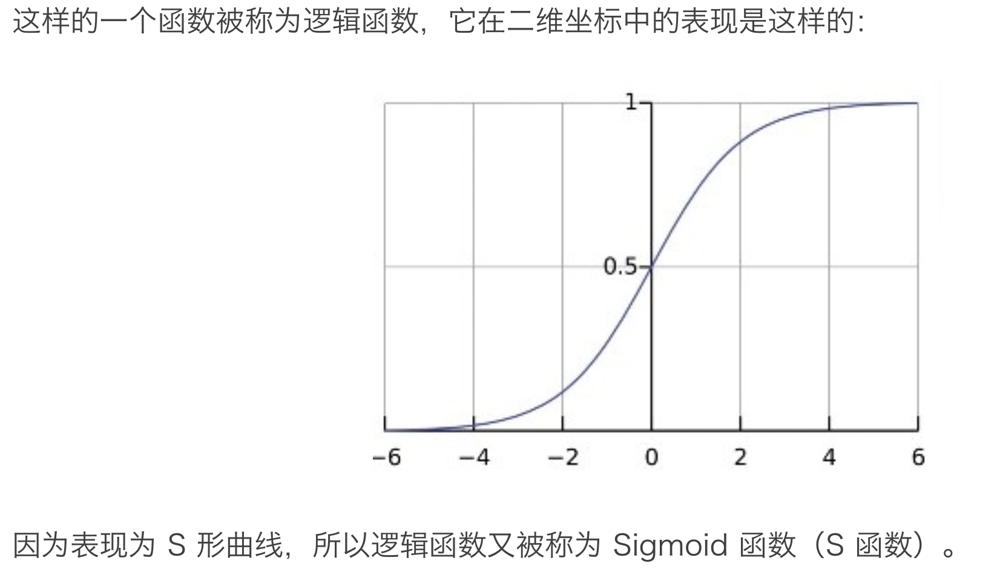

#### 逻辑回归 Logistic Regression （LR）

逻辑回归的模型函数 $ h_\theta(x) = \frac{1}{1+e^{-\theta^Tx}} $

#### 借助数学工具解决问题的方法

* 首先，将目标问题定义为一个函数；

* 之后，选取最简单的假设作为其具体形式；

* 然后，用事实数据验证该形式，确认有效后沿用，形成数学模型；

* 一旦当前采用的数学模型出现问题，则对其进行修正（添加修正项），同样借助事实数据来求取修正项的形式，形成新的（升级版）数学模型。

**直接、简单、基于现有成果**——这也是人类在现实当中解决问题的各种有效方法的共同特征。

我们现在新面临的问题，有些此时尚未得到理想的 Solution。它们最终的解决，也必然遵循“直接、简单、基于现有成果”的原则。

“直接、简单”还比较抽象，但“现有成果”却是看得见摸得着的。

虽然随着新技术的发展，具体的新问题不断涌现，但实际上，技术发展的过程，整体而言是把问题的“量”扩大化的过程。

如果抽象层次更高一些，我们就不难发现，这些问题其实和以往的问题有许多共性所在。其实，新问题不过是旧问题在新情况、新场景下的变形而已。

既然如此，那些已经在实践中证明对于旧问题有效的方法、措施，也必然能够对解决新问题有所贡献。

还有，当一个方法应用到实践中去之后，在最初阶段有效是一种经验，随着经验的积累，研究者的深入探索，经验是有可能被提升为理论的。

理论相对于经验，更加清晰可描述、可解释；抽象层次更高，通用性更强，可以被应用到更广泛的领域。**学习理论相对于学习经验具备更长久也更深入的有效性。**

这也就是时至今日我们还要学习几千年前的几何定理、几百年前的物理化学定律的缘故。

机器学习就是这样一套已经逐步在形成理论的方法。相比而言，更新的深度学习还处在经验阶段。

尽管今时今日从媒体传播的角度来看，深度学习是一个更热门的领域，对比起来，似乎机器学习“过时了”，“没用了”。

但在解决人们的实际问题上，机器学习的应用远比深度学习广泛、深入、可控。

而且，机器学习是深度学习的基础。如果连最简单的机器学习模型都没有掌握，又怎么可能了解深度神经网络的原理和运作？

如果连 How it works 都不知道，就拿来当黑盒使用，那么无论是什么工具，你对它的应用就变成了“按一下电钮”那么简单，你个人的价值又如何体现呢？