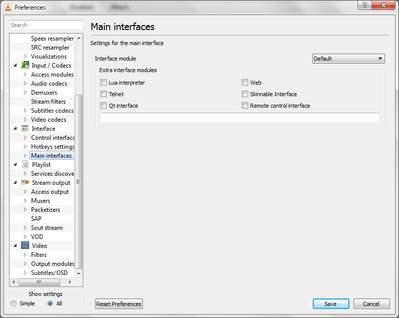
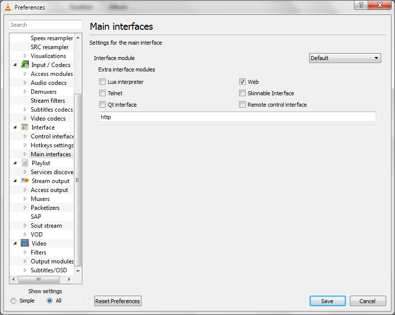
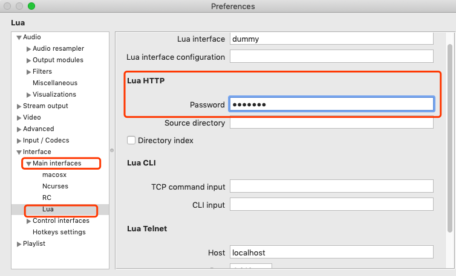

## 躺在沙发上看电影的正确姿势

### 解决什么问题
自己平时通过组装的一台 NAS 下载电影，这台 NAS运行着Ubuntu Desktop系统，
电影下载完了以后，通过 Nas 上面的 VLC 打开，然后在电视上播放。问题来了，观看的过程中
如果需要暂停，快进等操作，得从沙发上爬起来跑到电视旁边用鼠标操作，非常反人类。

### 解决途经
谷歌后发现 VLC 是可以通过 VLC Remote 软件进行远程控制的，这样躺沙发上，可以通过手机上的应用远程控制NAS上面的 VLC，实现进度条拖拉，换片，暂停播放等操作。

### 需要的软件

#### 被控制端：

[VLC](https://www.videolan.org/vlc/index.html) 播放应用, 目前看官网，基本全平台支持。

 

#### 控制端:

- 收费
  - IOS: [VLC Remote](https://apps.apple.com/us/app/vlc-remote/id297244048)
  - Android: [VLC Remote](https://play.google.com/store/apps/details?id=com.hobbyistsoftware.android.vlcremote_us)
- 免费
  - IOS: [VLC Remote Lite](https://apps.apple.com/us/app/vlc-remote-lite/id299344206)
  
  - Android: [VLC Remote Free](https://play.google.com/store/apps/details?id=com.hobbyistsoftware.android.vlcremote_usfree)
  
#### 确保被控制端与控制端处于同一网段 

### 安装设置

被控制端 

- 打开VLC 工具 -> 首选项 -> Interface

  

  

- 默认VLC显示的是简单设置选项。这里我们需要打开高级设置选项，在屏幕底部，单选 All。

  

  

- 点击Main interfaces 菜单

  

  

- 选中 Web

  
  
- 设置 Web 的访问密码，这个密码后续在控制端应用需要输入

  

- 保存，并重启 VLC 应用

- 确保控制端没有防火墙，或者已经针对 VLC 配置了防火墙入站策略

- 打开手机端 VLC Remote 应用，不出意外，应该会自动发现同一网段内运行 VLC 的机器，点击即可进行控制

- 躺沙发上，欣赏电影吧^_^

  

 